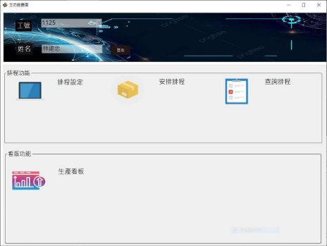
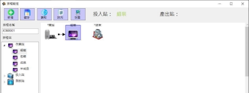
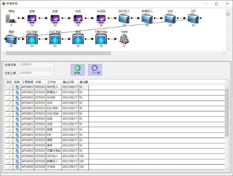
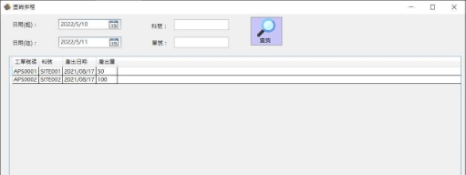
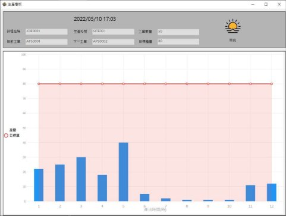

生產排程執行系統

APS WPF For C#

登入畫面

程式執行後，會出現登入畫面，提供登入/申請帳號的功能

- 登入：輸入工號/密碼即可登入
- 申請帳號：執行申請帳號按鈕即會出現申請帳號畫面

帳號申請

帳號申請

- 工號：輸入工號
- 姓名：輸入姓名
- 密碼：輸入密碼
- 確認：點選確認即可新增帳號
- 取消：點選取消則清除工號/姓名/密碼且不新增帳號

主功能

主功能

- 排程功能
  - 排程設定：切換排程設定畫面
    - 安排排程：切換安排排程畫面
  - 查詢排程：切換查詢排程畫面
- 看版功能
- 生產看板：切換生產看板畫面

排程設定

排程設定

- 新增：點選新增功能，可於排程 畫布上產生開始和結束工作站 點選排程站，則產生指定工作站 透過連結指定工作站順序
- 儲存：將排程設定結果依排程名稱 儲存
- 讀取：讀取排程名稱的排程設定
- 排列：重新排列排程畫布上的工作站
- 存圖：將排程設定存成圖片

新增排程

新增排程

- 新增：依排程名稱新增目前工單資訊
- 修改：修改排程內的產出日期和產出量
- 刪除：刪除排程內的工單資訊
- 下一張：切換下一張工單

查詢排程

查詢排程

- 日期(起)(迄)：輸入日期(起)(迄)
- 料號：輸入料號
- 單號：輸人單號
- 查詢：點選查詢後會將資訊顯示

生產看板

生產看板 新增排程後，會依工單的生產資訊 更新生產看板的工單數量並顯示統計 圖，紅線為目標數量，藍色長條圖為 目前已生產的工單數量，單位為每小時
